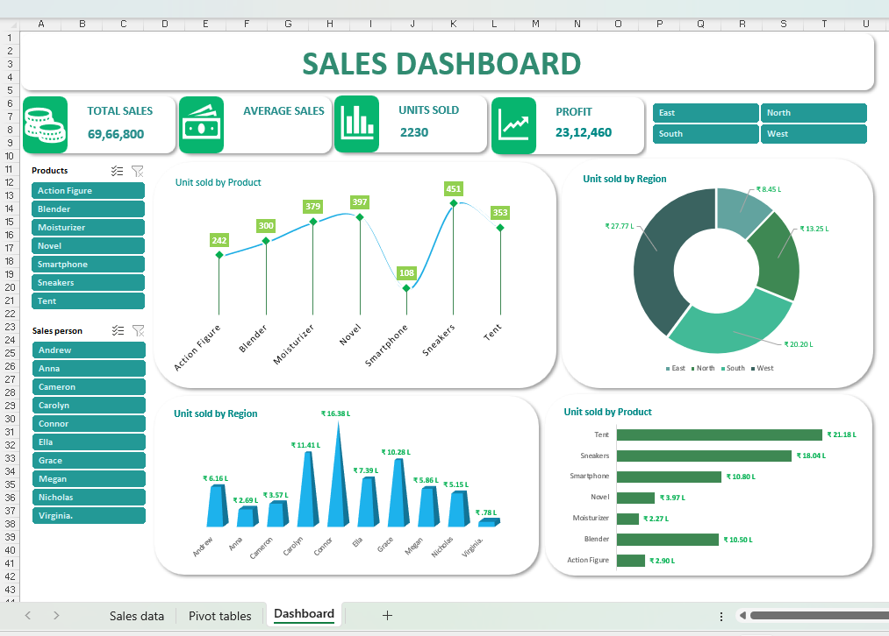

# Excel Sales Dashboard

## Overview
This project showcases an interactive Sales Dashboard built in Microsoft Excel.

## Features
- Total Sales KPI
- Average Sales KPI
- Units Sold Analysis
- Profit Analysis
- Product-wise Sales Tracking
- Region-wise Sales Tracking
- Interactive Slicers

## Tools Used
- Microsoft Excel
- Pivot Tables
- Pivot Charts
- Slicers
- Data Visualization

## Dashboard Preview

## Author
Nallini
